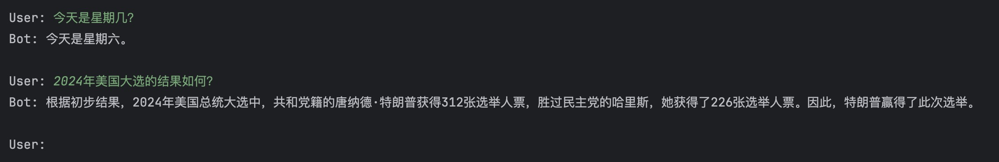
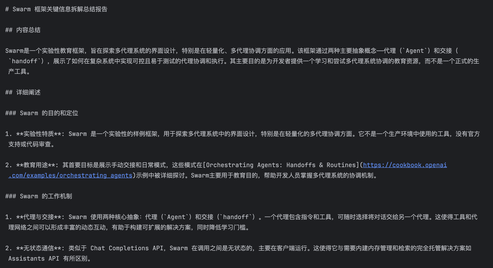
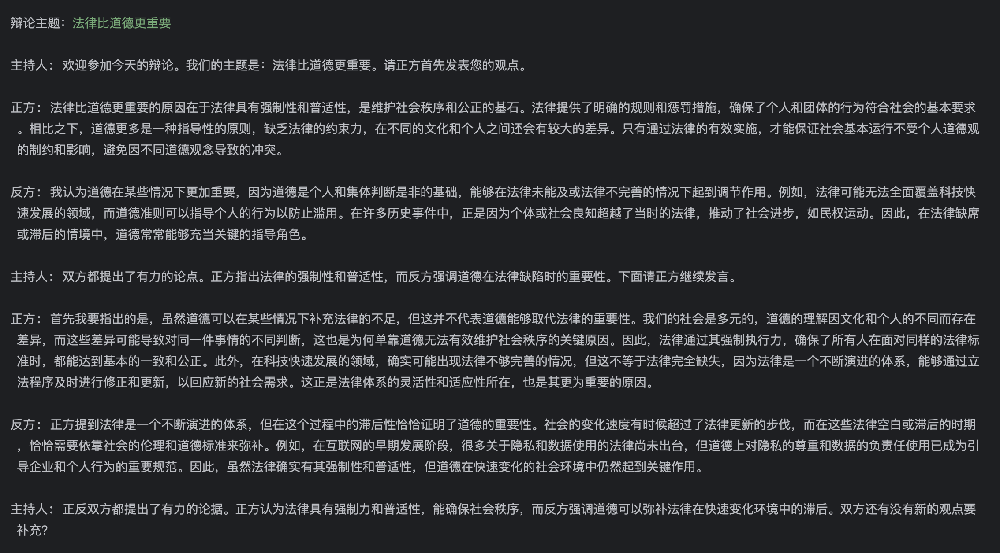
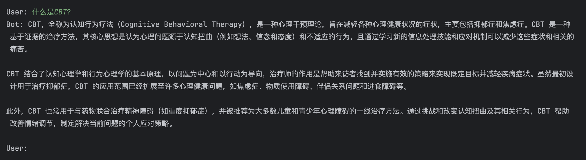
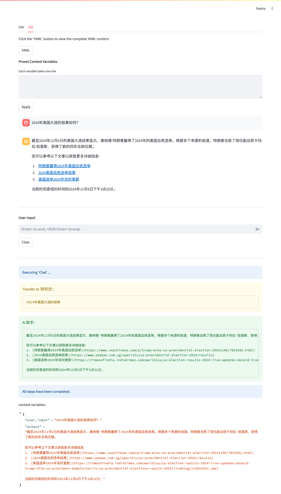

[English](./README.md) | 简体中文

# 多智能体工作流编排（集成 Swarm）

## 1. 设计目标

1. 将业务流程与代码逻辑解耦，以便业务人员独立编排和调试工作流；
2. 设计一套简洁的工作流数据格式，降低业务人员学习成本；
3. 工作流数据格式尽量兼顾灵活性，以便兼容多种业务场景。

## 2. 主要工作

1. 工作流配置文件遵循 YAML 语法；
2. 工作流配置文件兼容 Jinja2 模板，可在不修改代码的情况下，通过 Jinja2 语法控制分支、循环或传递变量；
3. 融合 Swarm 的特性，工作流内语言模型可根据用户请求自主切换智能体或调用外部函数 / 工具；
4. 提供极简的 UI 界面，便于业务人员配置、调试工作流。

## 3. 如何使用

### 3.1. 准备工作

#### 3.1.1. 获取代码

```shell
git clone https://github.com/x-glacier/SwarmFlow.git
cd SwarmFlow
```

#### 3.1.2. 配置大语言模型（LLM）

编辑配置文件 `swarm_flow/config.py`:
- `llm_settings`：用于配置LLM，根据需要设置对应的`base_url`、`api_key`和`default_model`等字段。
- `rag_settings`：用于配置RAG，根据需要设置对应字段。
- `tool_settings`：用于配置外部工具，如搜索引擎接口设置等。其中`web_search_proxy`用于为搜索引擎 API 配置代理，否则国内无法正常调用`duckduckgo`API。

*注：工作流配置文件中`workflow`的`llm_provider`字段，对应`config.py`文件中`llm_settings`的子项名称（例如`openai`），二者必须匹配。*

#### 3.1.3. 安装 python 依赖

建议先使用 anaconda3 创建并激活虚拟环境：

```shell
conda create -n swarm_flow python=3.11
conda activate swarm_flow
```

安装依赖：

```shell
pip install -r requirements.txt
```

### 3.2. 运行示例

进入`examples`目录：
```shell
cd examples/cn
```

#### 3.2.1. 多轮对话（结合搜索引擎）

运行以下命令：
```shell
python basic.py
```

截图：


与此示例对应的工作流配置文件为`data/workflows/cn/basic.yaml`。

若希望验证工作流能否正确处理“时效性”信息，可尝试以下提问：
- 今天是星期几？
- 今年国庆节前后，中国股市的总体情况如何？

#### 3.2.2. 文章导读

将需要解读的文章内容填入`guide_to_reading.txt`，然后运行以下命令：
```shell
python guide_to_reading.py
```

截图：


与此示例对应的工作流配置文件为`data/workflows/cn/guide_to_reading.yaml`。 

若希望查看所有调试信息，可编辑`guide_to_reading.py`，将`debug`设置为`True`。

#### 3.2.3. 模拟辩论赛

运行以下命令：
```shell
python debate_competition.py
```

截图：


程序启动后需要用户输入辩论主题，例如：“科技让生活更美好”，“法律比道德更重要”等。

示例为正反双方辩论模式，对应的工作流配置文件为`data/workflows/cn/debate_competition.yaml`。

#### 3.2.4. 检索增强生成（RAG）

运行以下命令：
```shell
python rag.py
```

截图：


与此示例对应的工作流配置文件为`data/workflows/cn/rag.yaml`。

若希望验证工作流能否从知识库中检索到正确的信息，可尝试提问：什么是CBT？

### 3.3. 图形界面

运行`streamlit run simple_ui.py`会在后台启动`streamlit`服务，可通过浏览器访问`http://localhost:8501`打开 UI 页面，便于编辑和调试工作流。

基本操作（以“文章导读”工作流为例）：
1. 点击“Browse files”按钮，从`data/workflows/cn`目录中选择`basic.yaml`，或者通过拖拽加载该文件；
2. 查看或修改各项配置；
3. 切换到“Test”标签页，在“User Input”输入框中贴入文章内容并键入回车键；
4. 查看输出结果是否符合预期。

截图1：


截图2：


## 4. 工作流 YAML 文件说明

### 4.1. YAML 基础语法

- ‌大小写敏感‌：YAML 对大小写敏感。
- ‌缩进‌：使用空格进行缩进，通常使用两个或四个空格，不允许使用 Tab 键。相同层级的元素左侧对齐。
- ‌注释‌：使用 # 符号表示注释，从 # 到行尾的内容都会被解析器忽略‌。

### 4.2. YAML 数据结构

YAML 支持`纯量`、`数组`、`字典`三种数据结构。

纯量是最基本的数据结构，表示单个的、不可再分的值。以“键:值”的形式表示：
```yaml
key: value
```

数组用“-”表示，可理解为 Python 中的 list，如果要把一段数据放在数组内，可参考以下示例：
```yaml
list:
  - item1
  - item2
  - item3
```

字典是纯量与数组的嵌套组合，可理解为 Python 中的 dict，例如：

```yaml
name: 'John Doe'
title: 'Sample Text'
age: 30
books:
  - java
  - python
```

### 4.3. 示例

`data`目录中内置了一些工作流文件，此处以`basic.yaml`和`debate_competition.yaml`为例。

#### 4.3.1. `basic.yaml`

```yaml
# 工作流名称和描述（必填字段）
workflow:
  version: "1.1"
  name: "多轮问答"
  description: "多轮问答工作流，根据情况通过搜索引擎获取资料。"
  # llm_provider 必须与 config.py 中 llm_settings 的子项名称匹配。
  llm_provider: "openai"

# 外部函数/工具设置（可选字段，functions 是由多个 function 组成的数组）
functions:
  # ......
  # name 为函数名称
  - name: transfer_to_agent
    # description 为函数描述，用于LLM推理
    description: "将用户请求转交给另一个 Agent"
    # 函数参数
    parameters:
      type: object
      properties:
        # agent_name 为第一个参数名称
        agent_name:
          # 参数描述（用于LLM推理）
          description: "转交给名为 agent_name 的 Agent"
          # 参数类型
          type: string
          # enum 为可选字段，表示参数为枚举类型
          enum:
            - "研究员"
        # query 为第二个参数名称
        query:
          description: "用户请求"
          type: string
      # 调用函数时，必填的参数名称
      required:
        - agent_name
        - query

# 多 Agent 设置（必填字段，agents 是由多个 agent 组成的数组）
agents:
  - name: "AI 助手"
    # description 字段不参与工作流执行，仅为增强可读性
    description: "AI 助手，负责分发任务，并向用户返回结果"
    # instruction 字段对应 OpenAI API 参数 messages 中的 system 角色，多行字符串可以使用 “|” 处理
    instruction: |
      你拥有丰富的知识，但是没有最新的信息，也不擅长编写代码。你会遵守以下原则与用户对话：
      当用户请求中包含“今年”、“最近”、“今天”、“现在”等内容时，需要转交给`研究员`实时查询信息。
    # functions 包含可供调用的函数列表。
    functions:
      # OpenAI API 只支持纯英文函数名，Qwen 支持中文函数名
      - transfer_to_agent

  - name: "研究员"
    description: "研究员，负责通过网络获取最新信息"
    instruction: |
      你是一名资深的研究员，擅长通过 web_search() 在网络上检索与用户请求相关的最新信息。你会遵守以下原则处理用户请求：
      优先考虑信息的时效性和准确性。当用户请求中包含“今年”、“今天”、“最近”、“现在”等内容时，先通过 date() 获取当前时间，再把当前时间合并到用户请求中。
    functions:
      - web_search
      - date

# 工作流执行步骤（必填字段）
steps:
  - name: "Chat"
    # description 字段不参与工作流执行，仅为增强可读性
    description: "多 Agent 协作处理用户请求"
    # 若工作流中包含多个 step，需要通过 order 设定执行顺序
    order: 1
    # 当前 step 所使用的 agent
    agent: "AI 助手"
    # 可通过 execution 设定 step 的执行方式：sync / async
    # sync：同步执行，必须等待当前 step 完成才会执行下一个 step
    # async：异步执行（多个 step 并行），下一步无需等待上一步完成
    execution: sync
    # 若前一个或前几个 step execution 为 async，且当前 step 依赖前几个 step 的结果，需要在 prerequisite 中以数组的形式填入前置 step name，例如：
    # prerequisite:
    #   - step1
    #   - step2
    # output 用于保存 agent 的输出结果
    output:
      # 在其他位置可以通过 {{ assistant_output }} 引用此变量
      name: assistant_output
      # 目前支持三种输出格式：string, list, json，默认值为 string
      type: string
    prerequisite: []
```

#### 4.3.2. `debate_competition.yaml`（片段）

```yaml
workflow:
  version: "1.1"
  name: "主题辩论"
  description: "多智能体群聊模式，正反双方针对用户输入的内容自由辩论。"
  llm_provider: "openai"

agents:
  # ......
  - name: "主持人"
    description: "负责开场白和回答参与者的提问"
    system: "你是辩论主持人，你的具体工作是推动辩论，回答向你提出的问题，并决定何时结束辩论。"
    instruction: |
      你是辩论主持人，你的具体工作是推动辩论，回答向你提出的问题，并决定何时结束辩论。
      辩论主题：{{ propositional }}

      <对话记录>
      
      {{ "\n\n".join(conversation[-20:]) }}
      
      </对话记录>

      请根据以上对话记录，直接回答与你相关的问题，但不要参与辩论。
      请将你要说的话填入以下 json 数据的 content 字段。直接输出 json 结果，不要输出无关信息：
      {
        "role": "主持人",
        "content": <你要说的话>
      }
    functions: []
  # ......
# 工作流执行步骤
steps:
  # ......
  - name: "Step-2"
    description: "被选中的发言者表达观点或提出问题"
    order: 2
    agent: "{{ active_agent }}"
    execution: sync
    # history_length 用于设置 messages 中保留的历史对话数量（对应的 role 字段为 assistant 和 user）
    history_length: 0
    output:
      name: speech
      type: json
      # `post_processing` 用于加工 LLM 输出的内容，并生成最终的输出结果
      post_processing: format_speech_content
      # append_to 为可选字段，用于将输出结果追加至多个变量，以便工作流或外部代码引用
      append_to:
        # 向 conversation 变量追加新内容（conversation 为 list 类型）
        - variable: conversation
    prerequisite: []
 ```

`examples/cn/debate_competition.py`中演示了外部代码如何引用`append_to`字段中的`conversation`变量，也演示了如何使用`post_processing`。

### 4.4. Jinja2 基础语法

- {{ }}：用于装载表达式或变量。
- ：用于装载控制语句，例如 if 分支或 for 循环控制等。

if 分支：
```

...

...

...

```

for 循环：
```

{{ 迭代变量 }}

```

在工作流中的应用方式可参考`data/workflows/cn/guide_to_reading.yaml`。

## 5. 后续计划

- [X] 引用外部知识库：工作流中增加对 RAG（Retrieval Augmented Generation） 的支持。

## 6. 参考

[OpenAI Swarm](https://github.com/openai/swarm)
